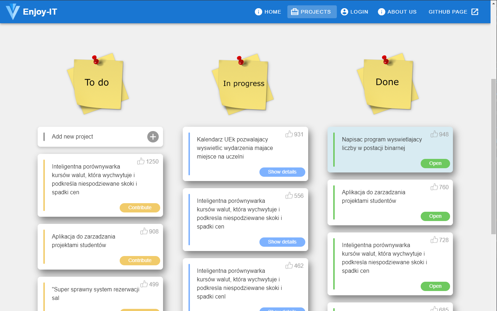
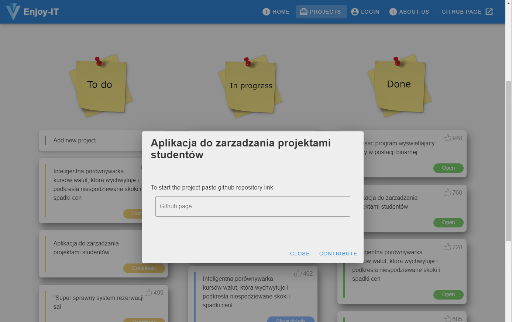
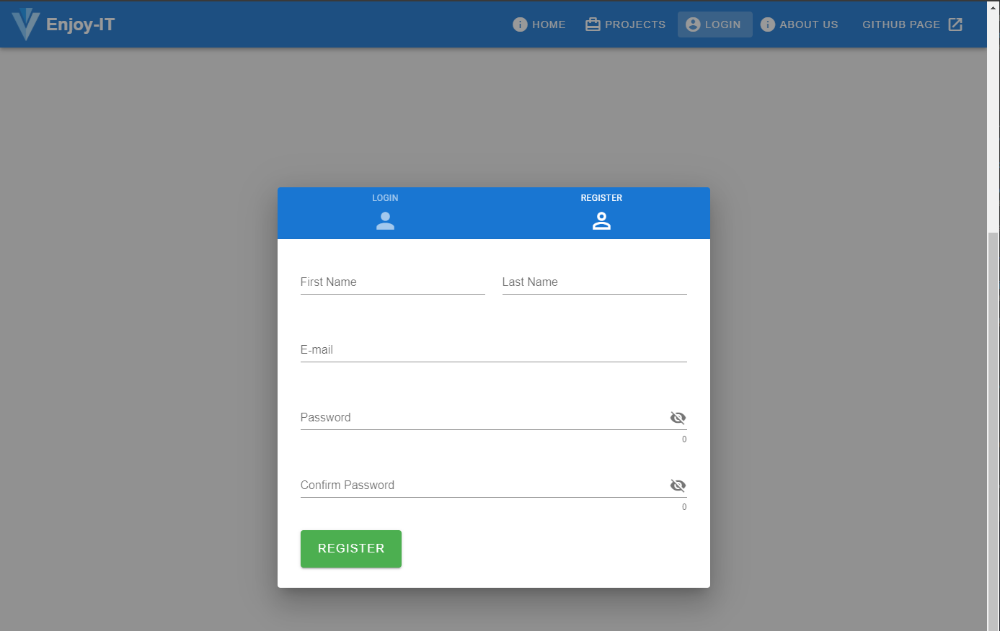

[Repozytorium projektu](https://github.com/flowerasny/EnjoyIT)

[Repozytorium witryny](https://github.com/jmaka96/jmaka96.github.io)

## Opis aplikacji

Aplikacja **EnjoyIT** służy do zarządzania projektami studentów. Każda osoba ma możliwość dodawania nowych problemów do wykonania, natomiast inne osoby mogą przyczyniać się do tworzenia danego projektu poprzez dodawanie linków do repozytoriów i aktywnego wnoszenia wkładu w utworzenie gotowego rozwiązania. Aplikacja stworzona przez M. Owczarski, J. Mąka, J. Kwiatek

### Cele aplikacji

*   Nadanie użyteczności projektom realizowanym podczas studiów,
*   Umożliwienie prowadzenia projektów międzywydziałowych.

### Funkcjonalności aplikacji

*   Udostępnienie efektu wykonywanego przez studenta projektu dla innych studentów,
*   Możliwość zgłaszania zapotrzebowanie na rozwiązanie danego problemu,
*   Możliwość zgłaszania pomysłów na konkretne produkty i znalezienia wykonawcy tego produktu (np. informatycznego), który będzie mógł go wykonać w ramach zajęć,
*   Możliwość głosowania za lub przeciw danemu projektowi, tworząc jednocześnie listę priorytetów.

### Screeny prezentujące działanie aplikacji

